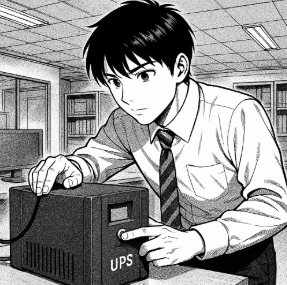

## T02 – Selecció d’un SAI (Sistema d’Alimentació Ininterrompuda)

### Descripció de la tasca
Aquesta tasca consisteix en realitzar l’estudi i la selecció d’un **SAI (Sistema d’Alimentació Ininterrompuda)** per a una empresa client anomenada **TecnoGestió S.L.**, dedicada a la gestió documental i l’assessorament informàtic.

L’empresa pateix constants talls elèctrics que afecten el funcionament dels seus equips informàtics.  
Com a **consultor júnior d’EverPia**, el teu objectiu és analitzar les necessitats energètiques de l’oficina i proposar el model de SAI més adequat per garantir la **continuïtat del servei** i la **protecció del maquinari**.

---

### Objectius de la tasca
- Comprendre el **funcionament i la importància d’un SAI** dins d’un entorn informàtic.  
- Calcular la **potència total necessària** per protegir tots els equips de l’empresa.  
- Determinar la **autonomia mínima** requerida en cas d’un tall de subministrament elèctric.  
- Comparar **models i marques de SAI** disponibles al mercat.  
- Justificar la tria final basant-se en **criteris tècnics, econòmics i de seguretat**.  

---

## Solució

A l'arxiu [solucio.md](solucio.md) hi ha solució descrita.

[Tornar pàgina projecte](../README.md)
